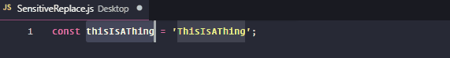
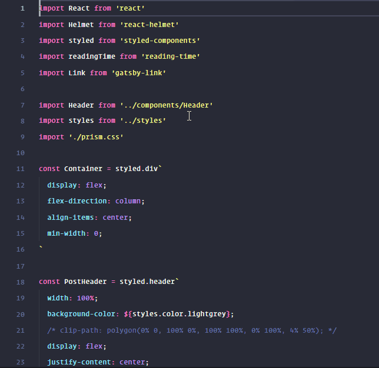
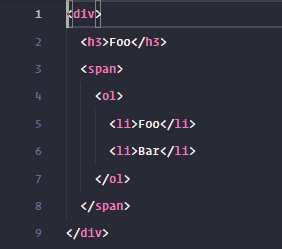
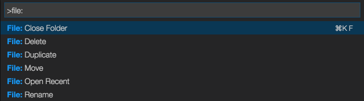
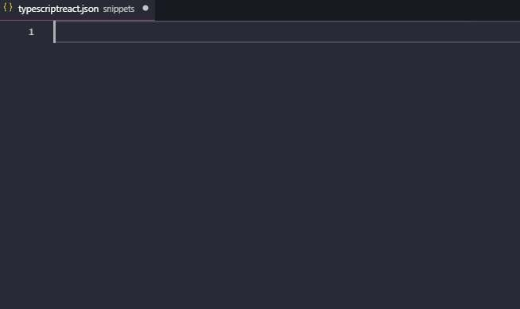
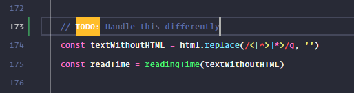

One of the things I enjoy most as a developer is to continuously find new ways to improve my workflow and work environment. I'm thus always on the lookout for new helpful tweaks and extensions.

Here's a list of my must-have VS Code extensions as of September 2018.

# 🔧 Settings Sync

This is the first extension I install when I set up VS Code on a new system. It lets you upload all relevant configuration data (extensions, keybinds, settings, snippets, etc) into a Gist on Github, making it dead simple to set up an identical configuration elsewhere. Once your settings are uploaded, simply run the `Sync: Download Settings` command on your new system and you're good to go.

This extensions also makes it easy to keep the VS Code settings of two different systems "in sync". Perhaps you're frequently switching between your work computer and your personal computer at home, and you want to work in identical environments regardless of which computer you use. Settings Sync lets you accomplish exactly this in a fairly straightforward way.

💾 [Settings Sync](https://marketplace.visualstudio.com/items?itemName=Shan.code-settings-sync) at VS Marketplace

---

# 🔧 Sensitive Replace

Ever wanted to rename something without losing the individual casing in each occurrence? Sensitive Replace allows one to do this in two simple steps:

1. Select every instance of the word you want to change (this can be done with VS Code's built-in `Add Selection To Next Find Match` command, default keybind is `ctrl`+`D`).

2. Open up the commands menu (`ctrl`+`shift`+`p`), run `Sensitive: Replace selections`
and enter the word you want to change to.

Voilà!

> Side note: `ctrl`+`D` behaves slightly differently depending on if you run it with or without a selected word. Without, the next exact occurrence of whatever word your cursor is currently pointing at will be selected in a case sensitive manner. **With** a selected word, however, the match will be case-insensitive, which is what you would want in the scenario above.

💾 [Sensitive Replace](https://marketplace.visualstudio.com/items?itemName=vilicvane.sensitive-replace) at VS Marketplace

---

# 🔧 line-jumper

This little extension lets you jump up and down multiple lines at a time with `alt`+`⬆`/`⬇`. The default jump length is 10 lines, which feels reasonable. Even though incorporating jumping around like this into your workflow takes some time getting used to, line-jumper is definitely a great step towards more keyboard-oriented file navigation for those of us that aren't quite ready for Vim yet.

> Side note: Holding both `alt` and `shift` lets you jump while selecting rows, which I've found super useful when selecting larger chunks of code.

💾 [line-jumper](https://marketplace.visualstudio.com/items?itemName=alekseychaikovsky.line-jumper) at VS Marketplace

---

# 🔧 Auto Rename Tag

This very simple extension automatically keeps pairs of HTML tags in sync as you change them. Very handy, and I wouldn't be surprised if this functionality becomes part of VS Code itself shortly.

💾 [Auto Rename Tag](https://marketplace.visualstudio.com/items?itemName=formulahendry.auto-rename-tag) at VS Marketplace

---

# 🔧 File Utils

To quote the author of this extension, File Utils is "a convenient way of creating, duplicating, moving, renaming, deleting files and directories".

If you're like me, you'll agree that being able to do common tasks with commands is almost always preferred to using the mouse. You'll also agree that having this set of useful file management utilities added to VS Code makes life a little easier.

💾 [File Utils](https://marketplace.visualstudio.com/items?itemName=sleistner.vscode-fileutils) at VS Marketplace

---

# 🔧 easy-snippet

As of late, the folks behind VS Code seem to be doing most things right. One thing that does have some room for improvement, though, is the process of creating snippets. The whole concept of editing strings in a JSON file (while manually having to fix indentation, etc.) isn't very user-friendly.

This little extension transforms your selection of code into a snippet-ready JSON format, vastly decreasing the time required to create a snippet.

💾 [easy-snippet](https://marketplace.visualstudio.com/items?itemName=inu1255.easy-snippet) at VS Marketplace

---

# 🔧 TODO Highlight

This little extension makes sure you don't leave a bunch of TODOs sprinkled throughout your code. It does this by highlighting every instance of "TODO:" in an noticeable way. It's also very customizable, allowing you to change highlight color, case sensitivity, keyword, and more.

💾 [TODO Highlight](https://marketplace.visualstudio.com/items?itemName=wayou.vscode-todo-highlight) at VS Marketplace

---

# 🎨 Color Theme: Dracula

Finally, I feel like I should recommend at least one color theme. Since I usually never stick with a single theme for more than a few months in a row, deciding which one to recommend took some time. Both Dracula and [Ayu](https://marketplace.visualstudio.com/items?itemName=teabyii.ayu) are great, but the former is probably the one I've returned to most often.

Dracula is also available for 50+ apps, including Visual Studio, Slack, React DevTools, iTerm, etc. Have a look at their [website](https://draculatheme.com/).

> Side note: Dracula is the theme used in the above gifs and images.

💾 [Dracula Official](https://marketplace.visualstudio.com/items?itemName=dracula-theme.theme-dracula) at VS Marketplace