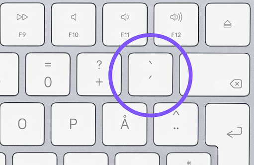
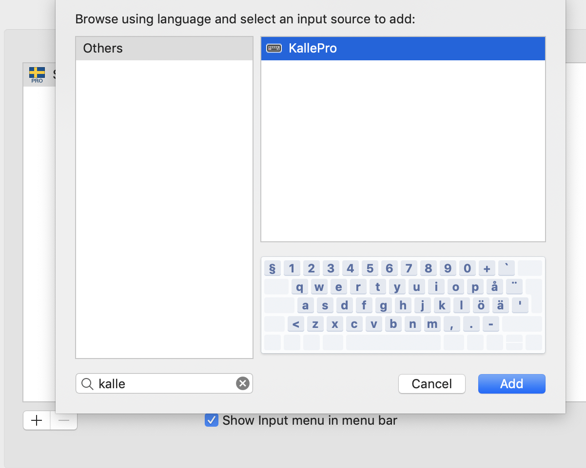
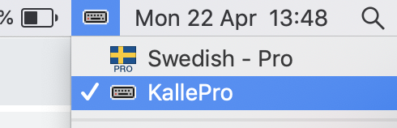

As a developer, I use backticks (`` ` ``) frequently to highlight code in Markdown files. Once you get into the habit of using them, you start to realize that they're available in a lot of places. Websites closely related to code, such as Github and BitBucket, often use Markdown, but so does Jira, Slack, and a bunch of other websites and applications. Heck, you can even use them in Facebook Messager:


# The problem

Typing backticks in a Scandinavian keyboard layout is a real burden. This is much because of the button's [dead key](https://en.wikipedia.org/wiki/Dead_key) behavior, where a single key press "waits" for a second character input to be potentially modified with an [accent mark](https://www.computerhope.com/jargon/a/accent.htm) (ò, é, etc).



> Note: This post specifically refers to the backtick key found on a Scandinavian keyboard layout, circled in the image above.

I've found that `shift`+`` ` ``+`space` is probably the most consistent way of typing a single backtick without accidentally modifying any following characters. This works, I guess, but it's not great, and considering this is something I'm doing many times every day, a better solution is desirable.

# The solution

I realized that I virtually *never* use this key for anything other than backticks, so why even bother with the deadkey behavior at all?

Enter [Ukelele](https://scripts.sil.org/cms/scripts/page.php?site_id=nrsi&id=ukelele). This neat little keyboard manager lets you remap any key to any output. Here's a step by step guide on how to remove the backtick key's deadkey behavior, resulting in a single backtick output on every keypress.

1. Open up Ukelele. This will present you with a blank keyboard layout.
2. Go to `File` -> `New From Current Input Source`. This will open up the `Keyboard Layout` dialog, and a copy of your current layout (e.g. `Swedish - Pro copy`) will be added automatically.
3. Open the layout by double-clicking it in the list. You can now close the other blank layout without saving.
4. From here, you can also close the `Keyboard Layouts` dialog. Doing this will prompt you to name and save the newly added layout (which I think is a little counter-intuitive). **Before saving**, make sure `File Format` is set to `Keyboard Layout`, not bundle.
5. Next, move or copy your newly saved layout file to `/Library/Keyboard Layouts`:
```bash
cp /path/to/file/<your-layout>.keylayout /Library/Keyboard\ Layouts
```
6. Open up the MacOS keyboard settings (preferably typing "*keyboard*" in Finder),  and go to the `Input Sources` tab.
7. Click the little `+` sign at the bottom left and search for your newly created keyboard layout to add it.

8. Before closing the dialog, make sure the `Show input menu in menu bar` checkbox is ticked.
9. From the menubar, switch the input source to your new keyboard layout.


That's it!

Every keypress of the backtick button should now output a single backtick character, and you no longer have to worry about accidentally modifying the next character with an accent. 🥳
